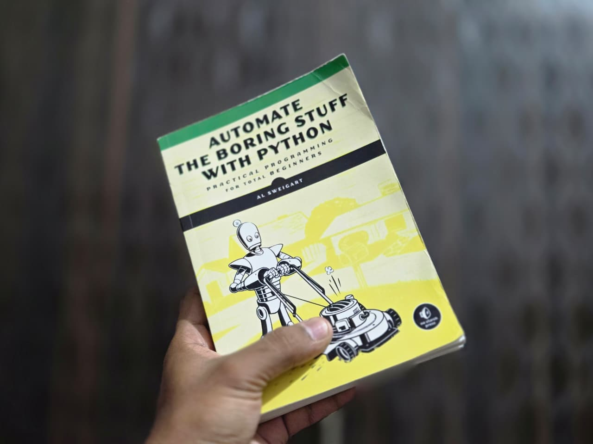

# Learning Python

This repository started as my way of learning Python while working through
**Automate the Boring Stuff with Python by Al Sweigart**.

What started with basic syntax and small programs gradually turned into
working with files, automation, APIs, web scraping, data, and a lot of
debugging along the way.

This book gave me a solid foundation and, more importantly, made me
comfortable with learning by building and experimenting.

I've now finished this part of the journey and I'm moving towards more
advanced Python, backend development, and eventually AI engineering.

I don't expect this repository to be the end of anything. It's simply where
this part started — and I'll keep building on it, learning new things and
moving forward.

> Started with the basics. Still a long way to go.
